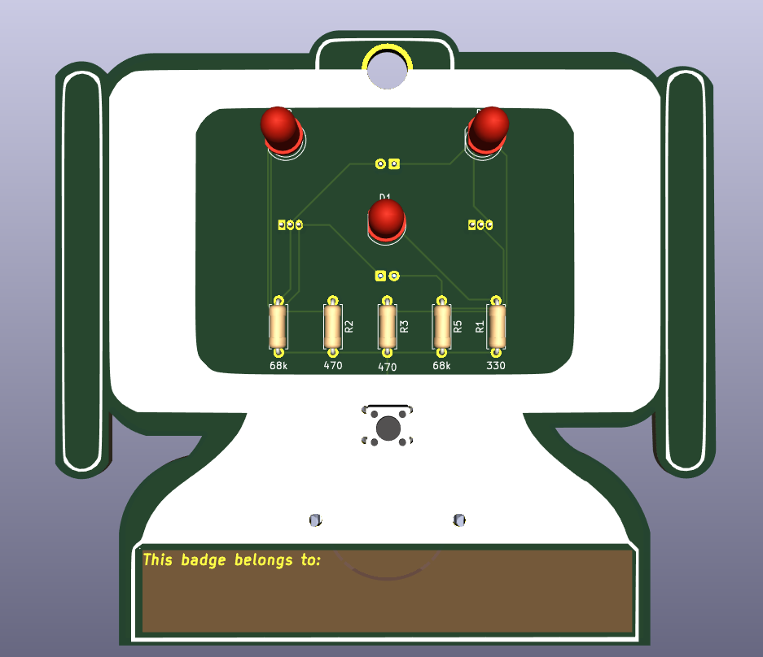

# Tiny RSC Badge

This repository contains the PCB design files for the **Tiny RSC Badge**, developed for the Robotic Study Companion (RSC) project.

The board is a small electronic badge designed around an **astable multivibrator circuit** that drives blinking LEDs. The project was created as a simple and compact PCB badge for the RSC platform.

## Design Summary

The PCB was designed in **KiCad**.

The circuit is based on an astable multivibrator, where two transistor stages continuously switch between ON and OFF states, causing the LEDs to blink alternately.

The board includes:

- Astable multivibrator circuit
- Two LEDs
- Transistors
- Resistors and capacitors for controlling the oscillation
- Compact badge-style PCB layout

The design focuses on simplicity, low component count, and a compact form factor suitable for use as an electronic badge.

---

## Author

Timur Kedrov  
Supervised & reviewed by Farnaz Baksh and Matevž Borjan Zorec
© Robotic Study Companion 2026